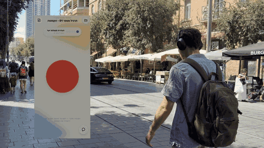
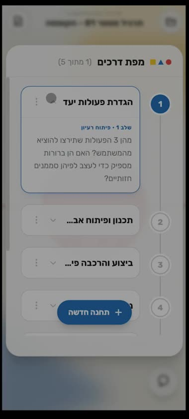

# Briefer

> A Hebrew-speaking Socratic voice mentor for first-year Visual Communication students at Bezalel. Upload the assignment brief, and it walks you through your own thinking — out loud, on the move, without ever handing you the answer.

<p align="center">
  
</p>

Design students get stuck between receiving a brief and having a first idea. A chatbot that answers for them removes exactly the part of the work that teaches. Briefer is built the other way round: it is a voice mentor with a hard rule against giving solutions, so the student keeps authorship of every idea while still having somebody to think against — walking to campus, standing in a shop, wherever the thinking actually happens.

Built as a research-through-design project for the Interaction Design studio, grounded in interviews with first-year Visual Communication students.

<table>
<tr>
<td width="35%"></td>
<td>

**The roadmap.** The uploaded brief is parsed into ordered stations — research, ideation, planning, execution, review — that the mentor follows linearly, one at a time. The student owns the plan: steps can be added, reopened, or skipped, and the mentor names any unfinished earlier step rather than quietly moving on.

**The voice stage.** A Gemini Live session with idle / listening / speaking states, transcribed both ways so every spoken turn persists as chat history. Text chat is the fallback in places you can't talk.

</td>
</tr>
</table>

## The Socratic constraint

`server/mentorPrompt.ts` is the single source of truth for mentor behaviour — the same rules feed brief analysis, text chat and the live voice session, so the mentor can't drift between modes. The rules are absolute, not suggestions:

- **No solutions, no options, no binary choices.** Not even a helpful-looking "is it sharp and bouncy, or flowing?" — a question like that injects the answer's vocabulary. The mentor asks the student to supply the description instead.
- **One open question per turn.** A clarifier on the same point is allowed; a second question is not.
- **No proactive interpretation.** The mentor never unpacks a concept, metaphor or image on the student's behalf — that is the assignment.
- **Explicit consent before touching state.** Notes and roadmap steps change only after the student says so out loud.
- **Nothing invented.** No facts, names or requirements that aren't in the brief.

## How it works

```
brief PDF ──▶ Gemini analysis ──▶ roadmap of stations
                                        │
student speaks ──▶ Gemini Live (voice, both-way transcription) ──▶ spoken reply
                          │
                          └── tool calls: add_note · update_note · delete_note
                                          complete_step · add_step · reopen_step
                                  ↓
                    relayed over WebSocket → applied to project state → confirmed aloud
```

| Piece | What it does |
|---|---|
| `server.ts` | Express + `ws`. Holds the Gemini Live session, relays tool calls to the client and results back, serves the Vite app. |
| `server/mentorPrompt.ts` | The Socratic rules, brief-analysis prompt, chat and voice system instructions — one module, three consumers. |
| `src/hooks/useVoiceAgent.ts` | Client side of the voice session: audio in/out, transcription, executing tool calls against project state. |
| `src/hooks/useProjects.ts` | Projects, roadmap, notes and the cross-conversation learning profile, persisted in `localStorage`. |
| `src/components/` | Voice stage, progress bar, roadmap view, notes and conversation drawers, upload modal. |

Pausing rebuilds the whole context on resume — brief, roadmap state, notes, conversation history, learning profile — so a conversation picked up hours later doesn't start from nothing.

## Design

Hebrew, RTL throughout, mobile-first with the drawers docking as permanent panels above 1024px. The visual language is modern Bauhaus: red, blue, yellow, black and off-white, a strict grid, flat geometric shapes with hard offset shadows, Rubik, and micro-animations via `motion`.

## Running it

```bash
npm install
cp .env.example .env.local     # add GEMINI_API_KEY
npm run dev                    # tsx server.ts → http://localhost:3000
```

Google Cloud Text-to-Speech needs `GOOGLE_APPLICATION_CREDENTIALS` pointing at a service-account key; `TUNED_CHAT_MODEL`, `VERTEX_PROJECT` and `VERTEX_LOCATION` are optional and switch text chat to a fine-tuned model on Vertex AI.

`npm run build` bundles the client with Vite and the server with esbuild; `npm start` serves the result.

## Status

A studio project, not a product: state lives in `localStorage`, there are no accounts, and it's been used by its author and a handful of students rather than a cohort. The research it came from — interviews, the usability study, the fine-tuning dataset — stays out of this repository.

## License

Apache-2.0
